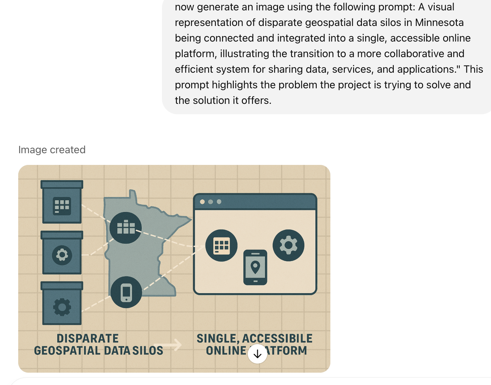

# notebookLM

* AIBT
* NotebookLM (Google NotebookLM) is a research and note-taking online tool developed by Google Labs
* it uses artificial intelligence (AI), specifically Google Gemini, to assist users in interacting with their documents.
* goal is  to assist users in interacting with their documents.
* It can generate summaries, explanations, and answers based on content uploaded by users
* It also includes "Audio Overviews", which summarizes documents in a conversational, podcast-like format
* Google describes it as a "virtual research assistant"
* released in September 2024, gained media attention for its ability to condense complex documents into engaging podcasts
* NotebookLM will summarize them and make interesting connections between topics, all powered by Gemini 1.5’s multimodal understanding capabilities
* link
  

# Business Topics and Use cases

* Data-Driven Insights: Gen AI for Decision-Making and Market Analysis
* Risk and Compliance: Compliance Automation, Risk Analysis and Regulatory Reporting
* Deep Dive Prompt Engineering: Exploring Success Stories, Learning Moments, and Effective Strategies
* Optimization: Strategies for optimizing internal workflows
* Future of Gen AI: Tools and Media (notebookLM)

## Use case observations

* Source: https://www.linkedin.com/pulse/notebooklm-case-studies-treefanevents-rrnzc
* I wanted to share something that's been a game-changer for my daily workflow—NotebookLM.
* excited about its nice deep dive and podcast-like features,
* I've found it’s so much more than that.
* it handles multiple data sources effortlessly,
* saving tons of time and hassle.
* From reviewing meeting recordings and pulling out action items
* to analyzing customer feedback and financial reports,
* it’s like having a super-smart assistant by your side.
* If you’re looking to boost your productivity and streamline your tasks,
* you might want to give NotebookLM a try.
 


## Data-Driven Insights: Gen AI for Decision-Making 

* https://www.rcalix.com/forecast.html
* https://www.youtube.com/watch?v=IVn-DmjbPy4
* Financial Report Analysis
* Use Case: Investment or Financial Planning
* Task: Extract key financial metrics and trends from financial statements.
* Example: "Analyze the quarterly financial reports of our top three competitors.
* What are their revenue trends, profit margins, and any notable financial strategies?
* 

## Use Case: Marketing or Internal Communications

* Content Curation for Newsletters
* Task: Organize and summarize articles, blogs, and other content for distribution.
* Example: "Gather the latest articles on AI advancements from our preferred sources.
* Summarize each article and suggest which ones should be included in next week's newsletter.

## Data-Driven Insights: Market Analysis

* Research Paper Summarization
* Example: https://papers.nips.cc/paper_files/paper/2023/file/007f4927e60699392425f267d43f0940-Paper-Conference.pdf
* Use Case: Academic or Market Research
* Task: Summarize lengthy academic papers or industry reports.
* Example: Here are several research papers on renewable energy.
* Can you summarize the key findings and methodologies of each?
* Highlight any emerging trends or significant breakthroughs.

  
## Customer Feedback Analysis

*  Use Case: Product Development or Customer Service
*  Task: Aggregate and summarize customer reviews or survey responses.
*  Example: "Here are 200 customer feedback entries for our latest product.
*  What are the most common praises and complaints?
*  Suggest areas for improvement based on the feedback."
* https://www.linkedin.com/pulse/notebooklm-case-studies-treefanevents-rrnzc

## Deep Dive Prompt Engineering: Exploring Success Stories, Learning Moments, and Effective Strategies

* Dialogue with your notes.
* When you’re writing something or preparing a presentation, use NotebookLM to assist in exploring your materials.
* Initiate a dialogue with your own notes.
* This ability to surface and connect valuable ideas otherwise hidden deep within the  notes or documents is what Steven Johnson finds most valuable about NotebookLM.
* https://www.fastcompany.com/91217096/googles-notebooklm-is-one-of-the-most-powerful-use-cases-for-ai
* 

## Optimization: Strategies for optimizing internal workflows

* Project Management Documentation
* Example: https://www.mngeo.state.mn.us/workgroup/commons/MN_Geospatial_Commons_Project_Plan_v1.3.pdf
* Use Case: Team Coordination or Task Tracking
* Task: Extract deadlines, milestones, and assigned tasks from project documents and meeting notes.
* Example: "Review our latest project documents and meeting recordings.
* What are the upcoming deadlines, and who is responsible for each task?
* https://www.linkedin.com/pulse/notebooklm-case-studies-treefanevents-rrnzc


## Training Materials Optimization

* Use Case: Employee Onboarding or Continuous Learning
* Task: Create summaries or highlight important sections from training videos and manuals.
* Example: "Here are several training videos for our new software tool.
* Summarize the key functionalities and create a quick reference guide for new employees.

## HR Policy Reviews

* Use Case: Human Resources Management
* Task: Summarize and highlight important sections from HR policies and employee handbooks.
* Example: "Here are our updated HR policies.
* Summarize the key changes and highlight any new compliance requirements that employees should be aware of.
* https://www.lsu.edu/hrm/files/2022/staff_handbook_2024.pdf

  
## Long Vendor Proposal Decks
*  Use Case: Streamlining Procurement and Decision-Making
*  Task: Extract and summarize key offers and value propositions from extensive vendor proposals.
*  Example: "Here are several vendor proposal decks.
*  Can you summarize what each vendor is offering and what I get for $X? Highlight the main benefits and any unique selling points.


## Risk and Compliance: Compliance Automation, Risk Analysis and Regulatory Reporting

* https://github.com/rcalix1/AI_auditing
* https://www.youtube.com/watch?v=1uGiNxedn9U&t=12s
* Legal Document Analysis
* Use Case: Contract Management or Compliance
* Task: Extract and compare key clauses from multiple legal documents.
* Example: I have several supplier contracts. What are the main differences in the termination clauses?
* Highlight any potential compliance issues.
* https://www.linkedin.com/pulse/notebooklm-case-studies-treefanevents-rrnzc

## Visuals with napkin.ai

* https://en.wikipedia.org/wiki/History_of_France
* load link on notebookLm
* and get timeline
* napkin.ai
* paste timeline text to napkin.ai


## Gen Image from notebookLM text

* https://en.wikipedia.org/wiki/History_of_France
* load link on notebookLm
* then ask notebook lm to generate prompts about the text that you can use to generate images
* "joan of ark leads the french army"


## Other Example Img

* link



## Links

* notebooklm.google.com
* https://notebooklm.google
* https://www.linkedin.com/pulse/notebooklm-case-studies-treefanevents-rrnzc
* link

# 📘 NotebookLM in Action: Business Simulation for a 90-Minute Talk

This interactive session presents NotebookLM as a live decision-making assistant. Instead of a traditional lecture, the audience will follow along as you simulate solving real business problems using Google’s NotebookLM.

---

## 🏢 Scenario: GreenCore Renewables – The Case Simulation

You're the newly hired Strategy Officer at **GreenCore Renewables**, a mid-sized company facing operational decline. You have only 90 minutes to:

* Analyze internal reports
* Understand customers
* Choose between vendors
* Address HR risks
* Brief leadership

Your co-pilot: **NotebookLM**.

The talk is structured around 5 live missions.

---

## 📂 Setup: Create a Notebook in NotebookLM

* Title: `GreenCore Business Audit`
* Upload the documents below (each represented here by sample content).

---

## 🟢 Mission 1: Financial Insight Mining

**Document Name**: `GreenCore_Q2_Q3_Financials.pdf`

**Prompt**:

> "What are the top 3 drivers of declining revenue in the last 3 quarters?"

**Sample Document Text**:

```
Revenue (Q1): $12.4M
Revenue (Q2): $10.1M
Revenue (Q3): $9.3M

Key observations:
- Residential solar installs dropped 22% due to delays in permitting.
- Battery sales decreased 17% following federal subsidy cuts.
- Churn rate increased from 8% to 14%, especially in California.

Operating Expenses:
- Marketing increased 12% due to aggressive acquisition.
- Software licensing costs grew 9% with new CRM rollout.
```

**Follow-up Prompts**:

* "List departments with expense increases over 10%."
* "Summarize financial trends in plain English."

---

## 🟡 Mission 2: Customer Feedback Analysis

**Document Name**: `Customer_Survey_July-Aug.pdf`

**Prompt**:

> "What are the most common praises and complaints?"

**Sample Document Text**:

```
Sample Comments:
- "The install crew was professional and fast."
- "Billing is confusing and lacks clarity."
- "Great app — I can track my solar savings easily."
- "Waited 6 weeks for a callback on a maintenance issue."
- "Would recommend the system to friends."

Tags (auto-coded):
- Praise: install quality (47%), mobile app (31%)
- Complaints: customer service delays (41%), unclear billing (36%)
```

**Follow-up Prompts**:

* "Summarize praise themes."
* "Suggest 3 areas for product/service improvement."

---

## 🔵 Mission 3: Competitor Positioning

**Document Names**:

* `EcoVolt_Whitepaper.pdf`
* `ClearWind_PitchDeck.pdf`
* `GreenCore_BrandSummary.pdf`

**Prompt**:

> "Compare GreenCore’s positioning with EcoVolt and ClearWind."

**Sample Document Text (EcoVolt)**:

```
- Targets urban homeowners with sleek rooftop panels
- Emphasizes carbon-offset certificates with every install
- Offers 18-month 0% financing with installation bundles
```

**Sample Document Text (ClearWind)**:

```
- Focuses on rural installations and large commercial projects
- Offers bundled wind + solar hybrid packages
- Highlights lifetime support guarantee and hardware buyback
```

**Sample Document Text (GreenCore)**:

```
- Targets suburban households and small businesses
- Strength: modular systems and easy financing
- Weakness: limited post-installation support and no loyalty perks
```

**Follow-up Prompts**:

* "What gaps exist in GreenCore’s value proposition?"
* "What can GreenCore learn from its competitors?"

---

## 🟠 Mission 4: Vendor Proposal Analysis

**Document Names**:

* `VendorA_Proposal.pdf`
* `VendorB_Proposal.pdf`
* `VendorC_Proposal.pdf`

**Prompt**:

> "Which vendor offers the best deal under $250K?"

**Sample Document Texts**:

**Vendor A**:

```
- Price: $265K (before negotiation)
- Includes onboarding, training, and 18-month support
- Cloud-based, scalable to 10K users
- No cancellation fee
```

**Vendor B**:

```
- Price: $245K
- Lacks onboarding, but includes analytics dashboard
- Limited to 5K users
- Cancellation incurs 10% fee
```

**Vendor C**:

```
- Price: $225K
- Includes onboarding, no analytics
- Max 3K users, no SLA for support
- Free cancellation within 6 months
```

**Follow-up Prompts**:

* "Summarize pros/cons of each vendor."
* "Which vendor offers best ROI for a fast-scaling company?"

---

## 🟣 Mission 5: HR Policy & Risk Review

**Document Name**: `HR_Policies_2024.pdf`

**Prompt**:

> "Summarize key changes and highlight compliance concerns."

**Sample Document Text**:

```
Policy Updates:
- Expanded parental leave from 6 to 12 weeks
- Implemented remote work policy with quarterly reviews
- Code of conduct revised to include AI tool usage clause

Compliance Issues:
- Overtime policy still references 2020 Fair Labor Guidelines
- Grievance process references outdated contact emails
```

**Follow-up Prompts**:

* "Write an internal memo summarizing these changes."
* "Highlight sections that need urgent legal review."

---

## 🧠 Final Mission: CEO Briefing

**Prompt**:

> "Write a CEO-level summary with strategic recommendations across finance, customer experience, competition, vendors, and HR."

**Expected Output**:
A 5-bullet executive memo that draws on **all uploaded documents** and includes:

* Top financial threats
* Customer pain points
* Competitive disadvantage
* Recommended vendor
* HR risks + solutions

---

## 🧰 Bonus Tools

* Use **Audio Overview** on the financials or customer file
* Use **Napkin.ai** to generate a timeline or chart from extracted text
* Ask NotebookLM to: "Create 3 image prompts for this marketing text"

---

## 🎤 Audience Prompt Ideas (Optional Participation)

Let audience members submit a document or URL (if possible)
Prompt ideas:

* “Summarize this blog post in a tweet.”
* “Extract 3 risks from this contract.”
* “Write a client-facing summary of this whitepaper.”

---

## ✅ Closing

**Prompt**:

> "What’s the biggest benefit of using NotebookLM across multiple departments?"

Use the AI's answer to reinforce the message:

> NotebookLM reduces time-to-insight, aligns teams with a shared context, and ensures institutional knowledge doesn’t get buried in PDFs.

---

**Links**:

* [https://notebooklm.google.com](https://notebooklm.google.com)
* [https://napkin.ai](https://napkin.ai)
* [https://www.linkedin.com/pulse/notebooklm-case-studies-treefanevents-rrnzc](https://www.linkedin.com/pulse/notebooklm-case-studies-treefanevents-rrnzc)

---


